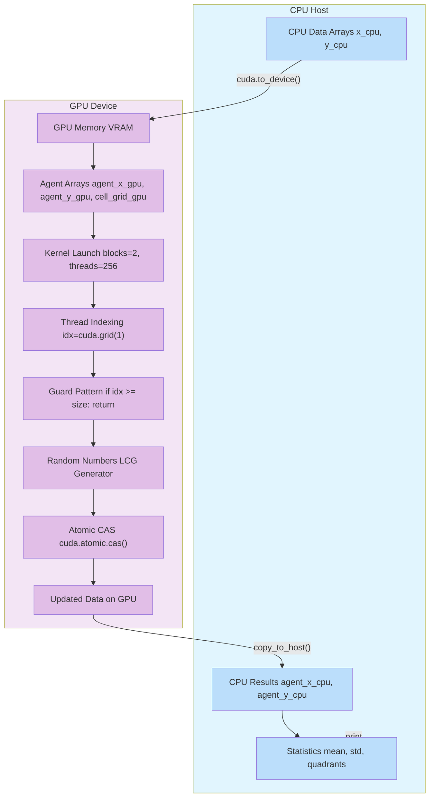
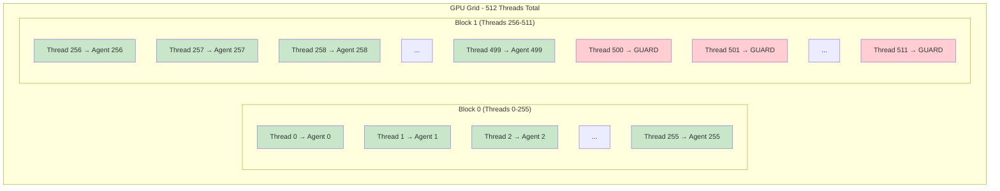
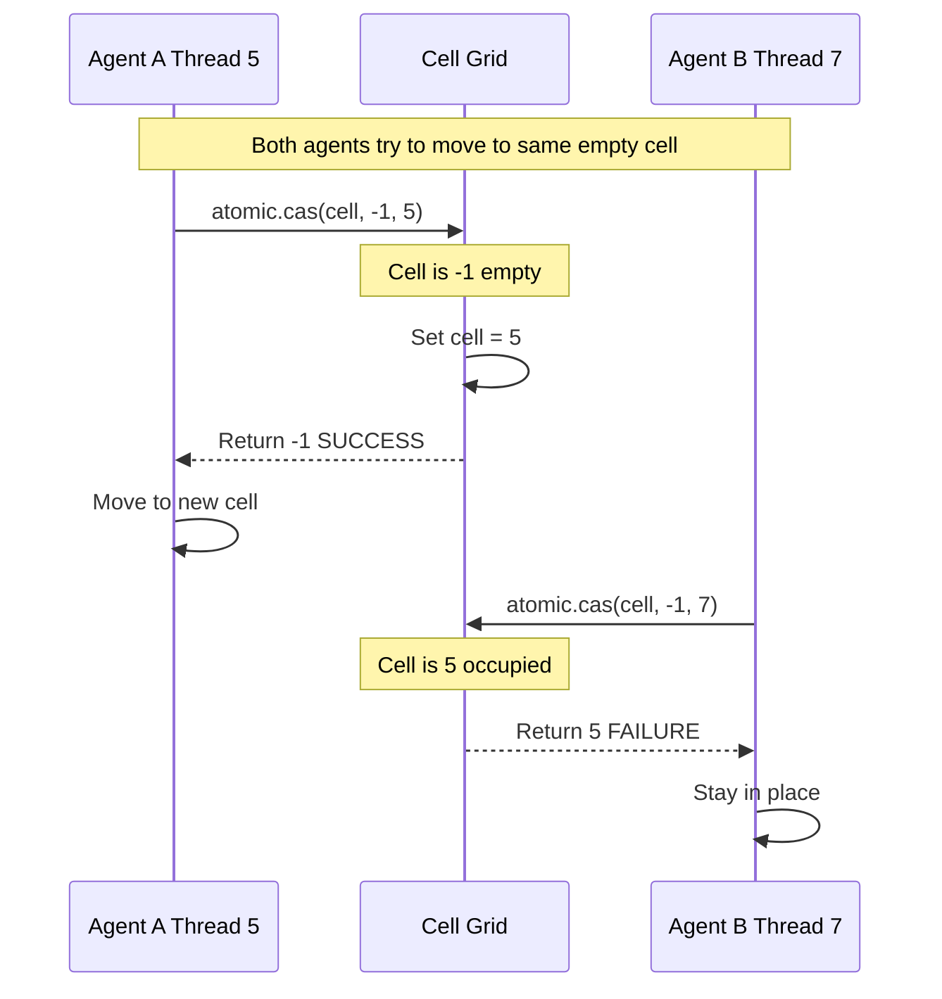

# 📚 Complete Guide: GPU Acceleration with Numba CUDA

## Introduction

This guide explains GPU acceleration concepts using Numba CUDA, based on a simple Agent-Based Model (ABM). The code demonstrates how to run thousands of agents in parallel on a GPU.

### Why GPU Acceleration?

| CPU (Sequential) | GPU (Parallel) |
|------------------|----------------|
| 1 core handles 1 agent at a time | 1000s of cores handle 1000s of agents simultaneously |
| Good for complex logic | Good for simple operations on many data points |
| Limited by clock speed | Limited by memory bandwidth |

---

## Installation Guide

### System Requirements

- NVIDIA GPU with CUDA support (Compute Capability 3.0+)
- Ubuntu/Debian Linux (or similar distribution)
- Python 3.7 or higher
- At least 4GB RAM recommended

### Ubuntu/Debian Setup

#### 1. Update System Packages

```bash
sudo apt update
sudo apt upgrade -y
```

#### 2. Install Required System Dependencies

```bash
# Essential build tools and Python development headers
sudo apt install -y build-essential python3-dev python3-pip

# CUDA toolkit dependencies
sudo apt install -y nvidia-cuda-toolkit

# Additional dependencies for Numba
sudo apt install -y libopenblas-dev libatlas-base-dev

# For GPU driver management
sudo apt install -y nvidia-driver-535  # Or latest version
```

#### 3. Install NVIDIA Driver (if not already installed)

```bash
# Check if you have an NVIDIA GPU
lspci | grep -i nvidia

# Check current driver
nvidia-smi

# If not found, install driver
sudo ubuntu-drivers autoinstall
sudo reboot
```

#### 4. Install CUDA Toolkit

```bash
# Add NVIDIA repository
wget https://developer.download.nvidia.com/compute/cuda/repos/ubuntu2204/x86_64/cuda-keyring_1.0-1_all.deb
sudo dpkg -i cuda-keyring_1.0-1_all.deb
sudo apt update

# Install CUDA
sudo apt install -y cuda-toolkit-12-3

# Set environment variables (add to ~/.bashrc)
export PATH=/usr/local/cuda/bin:$PATH
export LD_LIBRARY_PATH=/usr/local/cuda/lib64:$LD_LIBRARY_PATH
export CUDA_HOME=/usr/local/cuda

source ~/.bashrc
```

### Installing Numba and CUDA Python Packages

```bash
# Install CUDA Python headers (ESSENTIAL!)
pip install cuda-python

# Install Numba
pip install numba

# Install scientific packages
pip install numpy scipy matplotlib
```

### Complete Installation Script

Save as `install_gpu_env.sh`:

```bash
#!/bin/bash
echo "Setting up GPU environment for Numba CUDA..."

# System packages
sudo apt update
sudo apt install -y build-essential python3-dev python3-pip
sudo apt install -y nvidia-cuda-toolkit
sudo apt install -y libopenblas-dev libatlas-base-dev

# Check NVIDIA driver
if command -v nvidia-smi &> /dev/null; then
    echo "✅ NVIDIA driver found"
else
    echo "⚠️ Installing NVIDIA driver..."
    sudo ubuntu-drivers autoinstall
fi

# Python packages
pip install --upgrade pip
pip install cuda-python  # IMPORTANT!
pip install numba numpy scipy

# Verify installation
python3 -c "from numba import cuda; print(f'CUDA available: {cuda.is_available()}')"

echo "✅ Installation complete!"
```

Run:
```bash
chmod +x install_gpu_env.sh
./install_gpu_env.sh
```

### Verifying Installation

Create `test_gpu.py`:

```python
import numpy as np
from numba import cuda

print(f"CUDA available: {cuda.is_available()}")
if cuda.is_available():
    print(f"GPU: {cuda.get_current_device().name}")
    
    @cuda.jit
    def test_kernel(arr):
        idx = cuda.grid(1)
        if idx < arr.size:
            arr[idx] = idx
    
    arr = cuda.device_array(10, dtype=np.int32)
    test_kernel[1, 10](arr)
    print(f"Test: {arr.copy_to_host()}")
    print("✅ GPU test successful!")
```

Run:
```bash
python3 test_gpu.py
```

---

## Complete Code Example

```python
"""
SIMPLE GPU ABM - COMMAND LINE VERSION
Minimal implementation showing all 8 GPU acceleration concepts
"""

import numpy as np
from numba import cuda
import math

# ============================================================
# GPU KERNEL - Moves agents on the grid
# ============================================================

@cuda.jit  # CONCEPT 1: @cuda.jit decorator compiles for GPU
def move_agents_kernel(agent_x, agent_y, cell_grid, width, height, move_prob, iteration):
    """
    Each GPU thread handles ONE agent.
    CONCEPT 2: Thread Indexing
    """
    idx = cuda.grid(1)  # Each thread gets unique ID
    
    # CONCEPT 2: Guard Pattern
    if idx >= agent_x.shape[0]:
        return
    
    # Each thread handles ONE agent
    x = agent_x[idx]
    y = agent_y[idx]
    
    # CONCEPT 3: Pseudo-Random Number Generation on GPU
    # LCG (Linear Congruential Generator) - CPU's random() won't work
    seed = (idx * 1103515245 + 12345 + iteration * 1000000) & 0x7fffffff
    seed = (seed * 1103515245 + 12345) & 0x7fffffff
    rand_val = (seed & 0x7fffffff) / 2147483647.0
    
    if rand_val > move_prob:
        return
    
    # LOCAL VARIABLES: Per-thread, private, fast
    max_attempts = 8
    moved = False
    
    for attempt in range(max_attempts):
        # Generate random direction
        seed = (seed * 1103515245 + 12345) & 0x7fffffff
        dx = (seed % 3) - 1
        seed = (seed * 1103515245 + 12345) & 0x7fffffff
        dy = (seed % 3) - 1
        
        if dx == 0 and dy == 0:
            continue
        
        nx = x + dx
        ny = y + dy
        
        if not (0 <= nx < width and 0 <= ny < height):
            continue
        
        flat_idx = ny * width + nx
        current_flat = y * width + x
        
        # CONCEPT 4: Atomic Compare-And-Swap (CAS)
        # Thread-safe cell claiming
        old_val = cuda.atomic.cas(cell_grid, flat_idx, -1, idx)
        
        if old_val == -1:
            # Successfully claimed the cell
            cell_grid[current_flat] = -1
            agent_x[idx] = nx
            agent_y[idx] = ny
            moved = True
            break

# ============================================================
# SIMULATION CLASS
# ============================================================

class SimpleGPUABM:
    def __init__(self, width, height, num_agents, move_prob=0.3):
        self.width = width
        self.height = height
        self.num_agents = num_agents
        self.move_prob = move_prob
        self.step_count = 0
        self.total_cells = width * height
        
        print(f"\n{'='*60}")
        print(f"GPU ABM - CONCEPT DEMONSTRATION")
        print(f"{'='*60}")
        print(f"GPU: {cuda.get_current_device().name}")
        print(f"Grid: {width}x{height} = {self.total_cells} cells")
        print(f"Agents: {num_agents} ({num_agents/self.total_cells:.1%} occupancy)")
        print(f"{'='*60}\n")
        
        # CONCEPT 5: GPU Memory Allocation
        # cuda.device_array() allocates on GPU (VRAM), NOT CPU RAM
        self.cell_grid_gpu = cuda.device_array(self.total_cells, dtype=np.int32)
        self.agent_x_gpu = cuda.device_array(num_agents, dtype=np.int32)
        self.agent_y_gpu = cuda.device_array(num_agents, dtype=np.int32)
        
        self._fill_grid()
        self._place_agents()
        
        # CONCEPT 7: CPU copies for visualization/stats
        self.agent_x_cpu = np.zeros(num_agents, dtype=np.int32)
        self.agent_y_cpu = np.zeros(num_agents, dtype=np.int32)
        self._sync_from_gpu()
        
        print("✓ Simulation ready!\n")
    
    def _fill_grid(self):
        @cuda.jit
        def fill_kernel(grid, size):
            idx = cuda.grid(1)
            if idx < size:
                grid[idx] = -1
        
        # CONCEPT 6: Launch Configuration
        threads_per_block = 256
        blocks = (self.total_cells + threads_per_block - 1) // threads_per_block
        
        fill_kernel[blocks, threads_per_block](self.cell_grid_gpu, self.total_cells)
        
        # CONCEPT 8: cuda.synchronize()
        # Wait for GPU to finish before continuing
        cuda.synchronize()
    
    def _place_agents(self):
        block_size = int(math.ceil(math.sqrt(self.num_agents)))
        center_x = self.width // 2
        center_y = self.height // 2
        start_x = center_x - block_size // 2
        start_y = center_y - block_size // 2
        
        # CONCEPT 7: CPU-GPU Data Movement (CPU side)
        x_cpu = np.zeros(self.num_agents, dtype=np.int32)
        y_cpu = np.zeros(self.num_agents, dtype=np.int32)
        
        agent_idx = 0
        for dy in range(block_size):
            for dx in range(block_size):
                if agent_idx >= self.num_agents:
                    break
                x = start_x + dx
                y = start_y + dy
                if 0 <= x < self.width and 0 <= y < self.height:
                    x_cpu[agent_idx] = x
                    y_cpu[agent_idx] = y
                    agent_idx += 1
            if agent_idx >= self.num_agents:
                break
        
        # CONCEPT 7: CPU → GPU Data Transfer
        self.agent_x_gpu = cuda.to_device(x_cpu)
        self.agent_y_gpu = cuda.to_device(y_cpu)
        
        @cuda.jit
        def place_kernel(x_arr, y_arr, grid, num_agents, width):
            idx = cuda.grid(1)
            if idx < num_agents:
                flat_idx = y_arr[idx] * width + x_arr[idx]
                grid[flat_idx] = idx
        
        # CONCEPT 6: Launch Configuration
        threads_per_block = 256
        blocks = (self.num_agents + threads_per_block - 1) // threads_per_block
        
        place_kernel[blocks, threads_per_block](
            self.agent_x_gpu, self.agent_y_gpu,
            self.cell_grid_gpu, self.num_agents, self.width
        )
        
        # CONCEPT 8: cuda.synchronize()
        cuda.synchronize()
    
    def _sync_from_gpu(self):
        """
        CONCEPT 7: GPU → CPU Data Transfer
        This is SLOW - minimize transfers!
        """
        self.agent_x_cpu = self.agent_x_gpu.copy_to_host()
        self.agent_y_cpu = self.agent_y_gpu.copy_to_host()
    
    def step(self):
        # CONCEPT 6: Launch Configuration
        threads_per_block = 256
        blocks = (self.num_agents + threads_per_block - 1) // threads_per_block
        
        # Launch kernel - ALL agents move in parallel!
        move_agents_kernel[blocks, threads_per_block](
            self.agent_x_gpu, self.agent_y_gpu, self.cell_grid_gpu,
            self.width, self.height, self.move_prob, self.step_count
        )
        
        # CONCEPT 8: cuda.synchronize()
        # CRITICAL: Wait for GPU before reading results!
        cuda.synchronize()
        
        # CONCEPT 7: GPU → CPU Data Transfer (slow!)
        self._sync_from_gpu()
        
        stats = self._compute_stats()
        self.step_count += 1
        return stats
    
    def _compute_stats(self):
        mean_x = np.mean(self.agent_x_cpu)
        mean_y = np.mean(self.agent_y_cpu)
        std_x = np.std(self.agent_x_cpu)
        std_y = np.std(self.agent_y_cpu)
        
        return {
            'step': self.step_count + 1,
            'mean_x': mean_x,
            'mean_y': mean_y,
            'std_x': std_x,
            'std_y': std_y,
        }

# ============================================================
# MAIN
# ============================================================

def main():
    WIDTH, HEIGHT = 50, 50
    NUM_AGENTS = 500
    MOVE_PROB = 0.3
    STEPS = 20
    
    sim = SimpleGPUABM(WIDTH, HEIGHT, NUM_AGENTS, move_prob=MOVE_PROB)
    
    print("Running simulation...\n")
    print(f"{'Step':>6} {'Mean X':>8} {'Mean Y':>8} {'Std X':>8} {'Std Y':>8}")
    print("-" * 45)
    
    for i in range(STEPS):
        stats = sim.step()
        print(f"{stats['step']:>6} {stats['mean_x']:>8.2f} {stats['mean_y']:>8.2f} "
              f"{stats['std_x']:>8.2f} {stats['std_y']:>8.2f}")

if __name__ == "__main__":
    main()
```

---

## Data Flow Diagrams

### Complete Data Flow Diagram



### Thread Execution Visualization



### Atomic CAS Operation



---

## Concept 1: `@cuda.jit` Decorator

### What It Does
The `@cuda.jit` decorator tells Numba to compile a Python function for the GPU.

### Code Example:
```python
@cuda.jit  # This decorator compiles for GPU
def move_agents_kernel(agent_x, agent_y, cell_grid, width, height, move_prob, iteration):
    # GPU code here
```

### Key Points:
- **Kernels must be "pure"** - take all inputs as parameters, return nothing
- **No Python objects** - only simple types (int, float, array)
- **No CPU functions** - can't call `print()`, `random()`, etc.
- **Arrays are modified in-place** - no return values

### Why It Matters:
Without this decorator, the function runs on the CPU. The decorator transforms Python into CUDA machine code that runs on thousands of GPU cores simultaneously.

---

## Concept 2: Thread Indexing

### What It Does
Each GPU thread gets a unique ID using `cuda.grid(1)`.

### Code Example:
```python
# Each thread gets a unique ID (0, 1, 2, ...)
idx = cuda.grid(1)

# Guard pattern - threads without work exit
if idx >= agent_x.shape[0]:
    return

# Each thread handles ONE agent
x = agent_x[idx]
y = agent_y[idx]
```

### Key Points:
- **`cuda.grid(1)`** returns a unique integer index for each thread
- **We launch MORE threads than agents** (for GPU efficiency)
- **Guard pattern** (`if idx >= size: return`) prevents out-of-bounds errors
- **Mapping**: Thread N → Agent N (one-to-one)

### Why It Matters:
This is how we achieve parallelism - each thread works independently on its own piece of data.

---

## Concept 3: Random Numbers on GPU

### What It Does
Implements a custom random number generator because Python's `random` module doesn't work on GPU.

### Code Example:
```python
# LCG (Linear Congruential Generator)
seed = (idx * 1103515245 + 12345 + iteration * 1000000) & 0x7fffffff
seed = (seed * 1103515245 + 12345) & 0x7fffffff
rand_val = (seed & 0x7fffffff) / 2147483647.0

# Use the random value
if rand_val > move_prob:
    return  # Agent stays put
```

### Key Points:
- **LCG formula**: `seed = (a * seed + c) mod m`
- **Constants**: `a=1103515245`, `c=12345`, `m=2^31`
- **Iteration in seed**: Ensures different randomness each step
- **Per-thread seed**: Different `idx` gives different random sequences

### Why It Matters:
GPU threads can't call CPU functions. Each thread needs its own independent random numbers.

---

## Concept 4: Atomic CAS

### What It Does
Ensures thread-safe cell claiming when multiple agents try to move to the same cell.

### Code Example:
```python
# Try to claim the cell atomically
old_val = cuda.atomic.cas(cell_grid, flat_idx, -1, idx)

if old_val == -1:
    # SUCCESS! We claimed the empty cell
    cell_grid[current_flat] = -1  # Clear old cell
    agent_x[idx] = nx             # Update position
    agent_y[idx] = ny
```

### Key Points:
- **CAS** = Compare-And-Swap (check and replace in one step)
- **Atomic** = Operation is indivisible (no other thread can interfere)
- **Returns old value**: `-1` means cell was empty (success)
- **If not -1**: Another agent got there first (failure)

### Why It Matters:
Without atomic operations, two agents could move into the same cell simultaneously, causing a race condition.

---

## Concept 5: GPU Memory Allocation

### What It Does
Allocates memory directly on the GPU using `cuda.device_array()`.

### Code Example:
```python
# Allocate arrays on GPU (VRAM)
self.cell_grid_gpu = cuda.device_array(self.total_cells, dtype=np.int32)
self.agent_x_gpu = cuda.device_array(num_agents, dtype=np.int32)
self.agent_y_gpu = cuda.device_array(num_agents, dtype=np.int32)
```

### Key Points:
- **`cuda.device_array()`** = Allocates on GPU (VRAM)
- **`np.zeros()`** = Allocates on CPU (RAM)
- **GPU can't access CPU memory** directly
- **Memory is uninitialized** - must fill before use

### Memory Types:
| Type | Location | Speed | Access |
|------|----------|-------|--------|
| Global | GPU | Fast | All threads |
| Shared | GPU | Very Fast | Block only |
| Local | GPU | Fast | Single thread |
| CPU | RAM | Slow | CPU only |

---

## Concept 6: Launch Configuration

### What It Does
Configures how many threads and thread blocks to launch.

### Code Example:
```python
# Calculate launch configuration
threads_per_block = 256
blocks = (self.num_agents + threads_per_block - 1) // threads_per_block

# Launch kernel
move_agents_kernel[blocks, threads_per_block](...)
```

### Key Points:
- **`threads_per_block`** = Threads in each block (typically 256)
- **`blocks`** = Number of blocks (teams)
- **Total threads** = `blocks × threads_per_block`
- **Ceiling division** ensures enough threads for all data
- **256 is optimal**: Multiple of 32 (warp size), good resource balance

### Example:
```
500 agents, 256 threads/block:
blocks = (500 + 256 - 1) // 256 = 2
Total threads = 2 × 256 = 512
Threads 0-499 work, 500-511 exit (guard pattern)
```

---

## Concept 7: CPU-GPU Data Movement

### What It Does
Transfers data between CPU and GPU memory.

### Code Example:
```python
# CPU → GPU (upload)
self.agent_x_gpu = cuda.to_device(x_cpu)

# GPU → CPU (download)
self.agent_x_cpu = self.agent_x_gpu.copy_to_host()
```

### Key Points:
- **`cuda.to_device()`** = CPU → GPU (upload)
- **`.copy_to_host()`** = GPU → CPU (download)
- **Transfers are SLOW** (~16 GB/s vs GPU memory at ~500 GB/s)
- **Batch transfers** when possible
- **Minimize transfers** - keep data on GPU

### Performance Comparison:
```
Transferring all agents (500 agents × 2 arrays):
- 1000 integers × 4 bytes = 4,000 bytes per step
- Over 200 steps: 800,000 bytes (0.8 MB)

Transferring only statistics (20 bins):
- 20 integers × 4 bytes = 80 bytes per step  
- Over 200 steps: 16,000 bytes (0.016 MB)
- 50x less data transferred!
```

---

## Concept 8: Synchronization

### What It Does
Makes the CPU wait for the GPU to finish all work.

### Code Example:
```python
# Launch kernel
move_agents_kernel[blocks, threads_per_block](...)

# CRITICAL: Wait for GPU to finish
cuda.synchronize()

# Now it's safe to read results
self._sync_from_gpu()
```

### Key Points:
- **CPU blocks** (waits) until GPU finishes
- **Without sync**: CPU might read incomplete data
- **Always sync** before reading results back to CPU
- **Sync has cost**: CPU does nothing while waiting
- **Minimize sync**: Launch multiple kernels, sync once

### Visualization:
```
WITHOUT sync:
CPU: Launch kernel → Read data ❌ (GPU still working!)
GPU: Start work → Processing → Still working!

WITH sync:
CPU: Launch kernel → WAIT → Read data ✅
GPU: Start work → Processing → Done!
```

---

## Local Variables and Arrays on GPU

### What's Allowed

Inside a `@cuda.jit` kernel, you can use:

```python
@cuda.jit
def my_kernel(data):
    # ✅ Simple scalar variables
    idx = cuda.grid(1)
    temp = 0
    value = 3.14
    flag = True
    
    # ✅ Fixed-size arrays (size known at compile time)
    buffer = cuda.local.array(10, dtype=np.int32)
```

### What's NOT Allowed

```python
@cuda.jit
def bad_kernel(data):
    # ❌ Python lists
    my_list = [1, 2, 3]
    
    # ❌ Dynamic allocation
    size = data[0]
    dynamic = [0] * size
    
    # ❌ Python objects
    my_dict = {}
```

### Using `cuda.local.array()`

```python
@cuda.jit
def process_data(data, output):
    idx = cuda.grid(1)
    if idx >= data.shape[0]:
        return
    
    # Local array - each thread gets its own copy
    # Size must be a compile-time constant
    temp = cuda.local.array(5, dtype=np.float32)
    
    # Fill the array
    for i in range(5):
        temp[i] = data[idx + i] * 2
    
    # Process
    result = 0
    for i in range(5):
        result += temp[i]
    
    output[idx] = result
```

### Key Points:
- **Size must be constant** - no dynamic sizing
- **Each thread gets its own copy** - private memory
- **Very fast** - lives in registers or local memory
- **Limited size** - keep arrays small (under 100 elements)

---

## Performance Tips Summary

1. **Keep data on GPU** - Avoid unnecessary transfers
2. **Batch operations** - Process many agents at once
3. **Use 256 threads per block** - Optimal for most GPUs
4. **Minimize synchronization** - Sync only when needed
5. **Use atomic operations** - For thread-safe updates
6. **Simple operations** - GPU loves simple, repetitive work
7. **Avoid CPU functions** - No print(), random(), etc. in kernels
8. **Transfer only results** - Send small summaries back, not all data
9. **Use local arrays** - For small temporary buffers
10. **Avoid Python lists** - They don't work on GPU

---

## Common Pitfalls to Avoid

| Pitfall | Solution |
|---------|----------|
| Forgetting `cuda.synchronize()` | Always sync before reading results |
| Using Python lists in kernels | Use NumPy arrays or `cuda.local.array()` |
| Calling CPU functions in kernels | Implement GPU-compatible alternatives |
| Too many transfers | Keep data on GPU, transfer only results |
| Wrong thread count | Use multiples of 32, typically 256 |
| Not using guard pattern | Check `idx >= size` to prevent crashes |
| Large local arrays | Keep arrays small (under 100 elements) |
| Dynamic array sizes | Use compile-time constants for array sizes |

